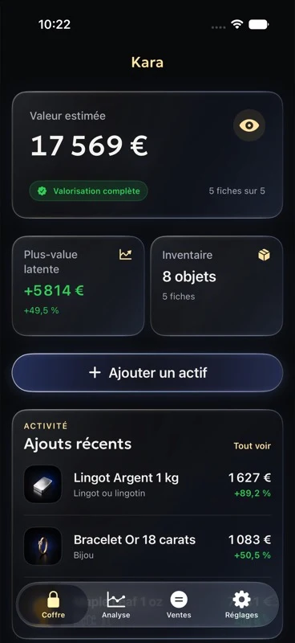
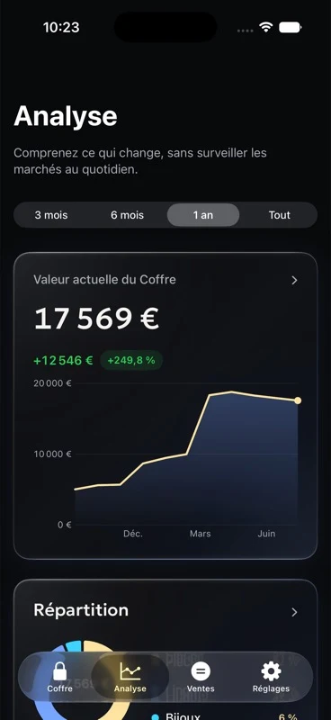
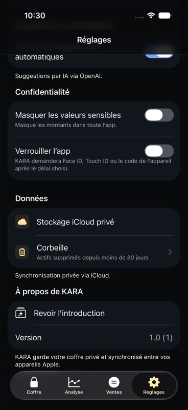

<p align="right">
  <a href="README.md">Read in English</a> ·
  <a href="https://kara.sudo-rahman.fr/">Site web</a>
</p>


<h1 align="center">KARA</h1>

<p align="center">
  <strong>Suivez vos lingots, vos pièces et vos bijoux au même endroit.</strong>
</p>

<p align="center">
  <a href="https://apps.apple.com/app/id6795243977">
    
  </a>
  <br>
  <sub>Disponible sur iPhone · La version Android est en préparation</sub>
</p>

---

Kara est une application pour inventorier vos lingots, vos pièces, vos bijoux et vos autres objets en métaux précieux. Pour chaque objet, vous pouvez enregistrer le poids, la pureté, le prix d’achat et l’emplacement, puis ajouter les photos, factures ou certificats qui vont avec.

L’app utilise les cours disponibles pour estimer la valeur du métal, suivre l’évolution de votre patrimoine et simuler une vente.

## Ce que vous pouvez faire

<table>
  <tr>
    <td width="50%" valign="top">
      <h3>Enregistrer vos objets</h3>
      Ajoutez le poids, la pureté, la quantité, le prix d’achat, l’emplacement, des notes et des tags.
    </td>
    <td width="50%" valign="top">
      <h3>Suivre leur valeur</h3>
      Consultez la valeur métal estimée, le coût total, la répartition de votre patrimoine et son évolution.
    </td>
  </tr>
  <tr>
    <td width="50%" valign="top">
      <h3>Préparer une vente</h3>
      Sélectionnez des objets et ajustez les quantités pour estimer le montant de la vente et la plus-value, sans modifier votre inventaire.
    </td>
    <td width="50%" valign="top">
      <h3>Garder les documents utiles</h3>
      Ajoutez des photos, des factures et des certificats. Kara peut aussi générer un rapport PDF sur votre appareil.
    </td>
  </tr>
</table>

<p align="center">
  
  &nbsp;
  
  &nbsp;
  
</p>

## Vos données restent privées

Kara ne vous demande pas de créer un compte. Votre inventaire reste sur votre appareil.

- Sur iPhone, vous pouvez le synchroniser dans votre base iCloud privée.
- Sur Android, les données sont stockées localement. Une sauvegarde dans l’espace privé de votre compte Google pourra être activée avec votre accord.
- Face ID, Touch ID ou le code de l’appareil peuvent protéger l’accès à l’application.
- Vous pouvez masquer les montants dans toute l’interface.
- Les rapports PDF sont générés directement sur l’appareil.

Le préremplissage depuis une photo ou une facture est facultatif et désactivé par défaut. Si vous l’activez, seul le fichier que vous avez choisi est envoyé pour analyse. Kara ne stocke pas votre inventaire sur ses serveurs.

Pour plus de détails, consultez la [politique de confidentialité](https://kara.sudo-rahman.fr/privacy).

## Télécharger Kara

La version iPhone est disponible sur l’[App Store](https://apps.apple.com/app/id6795243977). La version Android est en cours de développement et sera publiée plus tard.

## Pour les développeurs

Le dépôt contient les applications iOS et Android, le site web, l’API utilisée par les applications et les données communes aux deux plateformes.

| Dossier | Technologies principales | Contenu |
| --- | --- | --- |
| `apple/` | SwiftUI, SwiftData, CloudKit, WidgetKit | Application iPhone, widget et tests |
| `android/` | Kotlin, Jetpack Compose, Room, Google Drive | Application Android et tests |
| `website/` | SvelteKit, TypeScript, Redis | Site public et API |
| `shared/` | JSON | Catalogue d’actifs partagé |
| `app-store/` | JSON | Métadonnées et notes de version |
| `app-store-visuals/` | Images et scripts | Captures destinées aux stores |

### Lancer le projet

- **iOS :** ouvrez `apple/KARA/KARA.xcodeproj` dans Xcode. Les cibles actuelles nécessitent iOS 26.
- **Android :** suivez le [guide Android](android/README.md).
- **Site web :** consultez le [guide du site](website/README.md) ou lancez le serveur de développement :

```bash
cd website
pnpm install
pnpm dev
```

Les services utilisés en production demandent une configuration supplémentaire. Elle est détaillée dans les guides de chaque plateforme.

## Contribuer

Les rapports de bugs, corrections, traductions et améliorations d’accessibilité sont les bienvenus. Pour un changement important, ouvrez d’abord une issue afin d’en discuter.

Kara est distribué avec une licence non commerciale. Les contributions et les réutilisations du code doivent respecter cette licence.

## Licence

Le code est disponible sous la [licence PolyForm Noncommercial 1.0.0](LICENSE). Elle autorise notamment l’étude, la modification et la redistribution du logiciel pour un usage non commercial. Elle n’autorise pas la vente de Kara ou d’un produit dérivé.

Le fichier `LICENSE` contient les conditions complètes et fait foi.

---

<sub>Les valorisations et les simulations sont des estimations fondées sur les cours spot disponibles. Elles ne tiennent pas compte des primes, des frais, de la fiscalité, des pierres ou de la valeur numismatique. Kara ne fournit aucun conseil financier ou fiscal.</sub>
