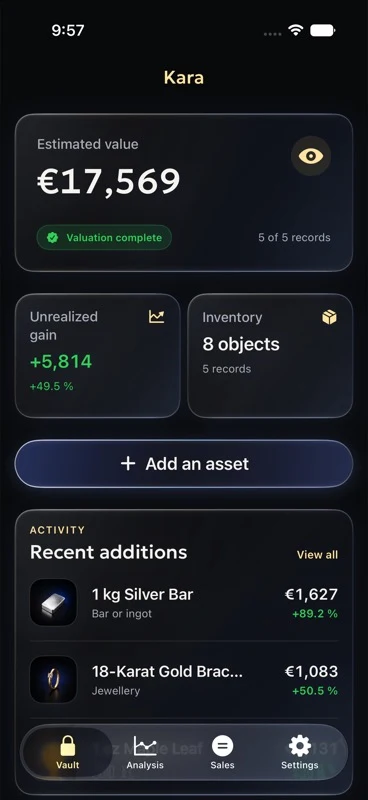
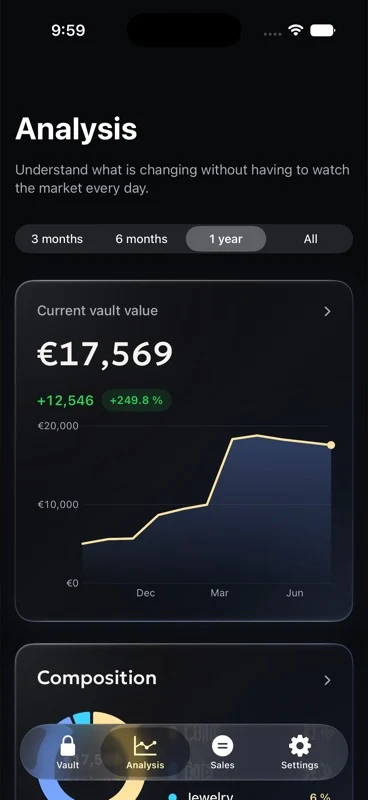
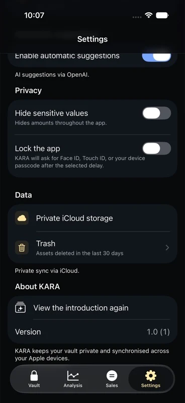

<p align="right">
  <a href="README.fr.md">Lire en français</a> ·
  <a href="https://kara.sudo-rahman.fr/en">Website</a>
</p>


<h1 align="center">KARA</h1>

<p align="center">
  <strong>Keep track of your bars, coins and jewellery in one place.</strong>
</p>

<p align="center">
  <a href="https://apps.apple.com/app/id6795243977">
    
  </a>
  <br>
  <sub>Available on iPhone · Android is in development</sub>
</p>

---

Kara is an app for keeping an inventory of your bars, coins, jewellery and other precious-metal items. For each item, you can record its weight, purity, purchase price and location, then attach the photos, invoices or certificates that belong with it.

The app uses available market prices to estimate the metal value of your holdings, track changes over time and simulate a sale.

## What you can do

<table>
  <tr>
    <td width="50%" valign="top">
      <h3>Record each item</h3>
      Add its weight, purity, quantity, purchase price, location, notes and tags.
    </td>
    <td width="50%" valign="top">
      <h3>Track its value</h3>
      See the estimated metal value, total cost, allocation and change over time.
    </td>
  </tr>
  <tr>
    <td width="50%" valign="top">
      <h3>Plan a sale</h3>
      Select items and adjust quantities to estimate the proceeds and gain without changing your inventory.
    </td>
    <td width="50%" valign="top">
      <h3>Keep the paperwork</h3>
      Attach photos, invoices and certificates. Kara can also generate a PDF report on your device.
    </td>
  </tr>
</table>

<p align="center">
  
  &nbsp;
  
  &nbsp;
  
</p>

## Your data stays private

Kara does not require an account. Your inventory stays on your device.

- On iPhone, you can sync it through your private iCloud database.
- On Android, data is stored locally. You will also be able to back it up to your Google account’s app-private storage with your permission.
- Face ID, Touch ID or the device passcode can protect access to the app.
- You can hide monetary amounts throughout the interface.
- PDF reports are generated directly on the device.

Automatic entry from a photo or invoice is optional and off by default. If you enable it, only the file you choose is sent for analysis. Kara does not store your inventory on its servers.

For more details, read the [privacy policy](https://kara.sudo-rahman.fr/en/privacy).

## Download Kara

The iPhone version is available on the [App Store](https://apps.apple.com/app/id6795243977). The Android version is under development and will be released later.

## For developers

This repository contains the iOS and Android apps, the website, the API used by the apps and data shared between both platforms.

| Directory | Main technologies | Contents |
| --- | --- | --- |
| `apple/` | SwiftUI, SwiftData, CloudKit, WidgetKit | iPhone app, widget and tests |
| `android/` | Kotlin, Jetpack Compose, Room, Google Drive | Android app and tests |
| `website/` | SvelteKit, TypeScript, Redis | Public website and API |
| `shared/` | JSON | Shared asset catalogue |
| `app-store/` | JSON | Store metadata and release notes |
| `app-store-visuals/` | Images and scripts | Store screenshots |

### Run the project

- **iOS:** open `apple/KARA/KARA.xcodeproj` in Xcode. The current targets require iOS 26.
- **Android:** follow the [Android guide](android/README.md).
- **Website:** read the [website guide](website/README.md) or start the development server:

```bash
cd website
pnpm install
pnpm dev
```

Production services need additional configuration. The platform guides cover the required setup.

## Contributing

Bug reports, fixes, translations and accessibility improvements are welcome. Please open an issue before starting a large change so it can be discussed first.

Kara uses a noncommercial license. Contributions and reuse of the code must comply with its terms.

## License

The code is available under the [PolyForm Noncommercial License 1.0.0](LICENSE). It allows you to study, modify and redistribute the software for noncommercial purposes. It does not allow you to sell Kara or a derivative product.

The `LICENSE` file contains the full terms and takes precedence over this summary.

---

<sub>Valuations and simulations are estimates based on available spot prices. They do not include premiums, fees, tax, stones or numismatic value. Kara does not provide financial or tax advice.</sub>
